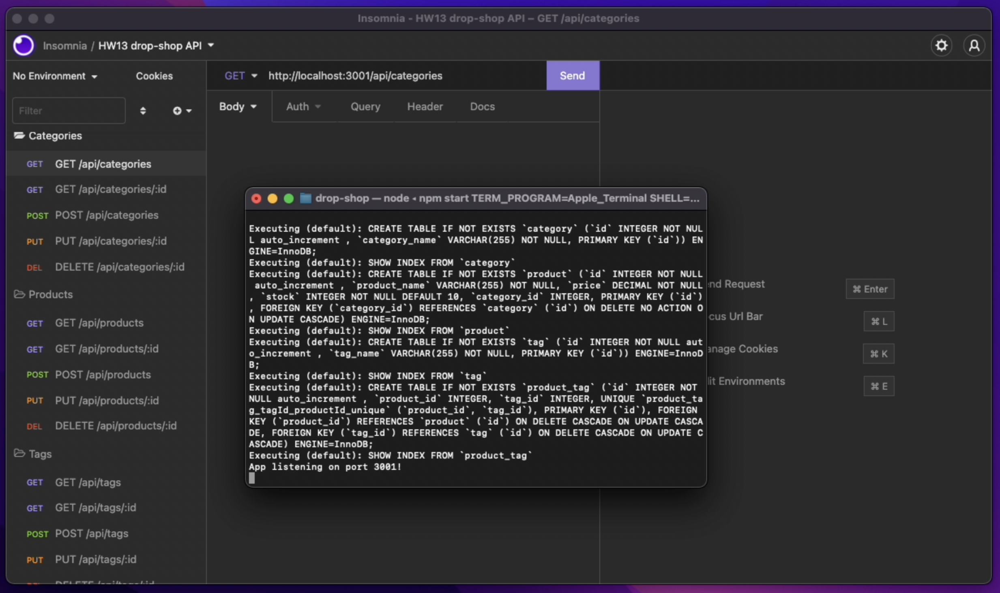

# 🛒 drop-shop
This is an e-commerce back-end for managing product details and inventory. The API is built with nodejs and express, and interacts with the MySQL database with sequelize and mysql2.

## Prerequisites
* nodejs
* MySQL

## Libraries
* express
* sequelize
* mysql2

## Setup
* Clone `git clone git@github.com:jmichaelbrown8/drop-shop.git`
* Install `npm i`
* Create your `.env` file with these contents:
    ```
    DB_USER=[your_username]
    DB_PW=[your_password]
    DB_NAME='ecommerce_db'
    ```
* Start the database:
    ```
    mysql -p
    > source db/schema.sql;
    > quit;
    ```
* Start `npm start`

## Development
In addition to the steps above, you can:
* Seed the database `npm run seed`
* Run in watch mode to update as you develop `npm run watch`

## Schema


## Usage

You can view a video of the server set up and running [here](https://drive.google.com/file/d/1b7PC407m07eZe9oEp-JnnWqW45d9cy2C/view?usp=sharing)

